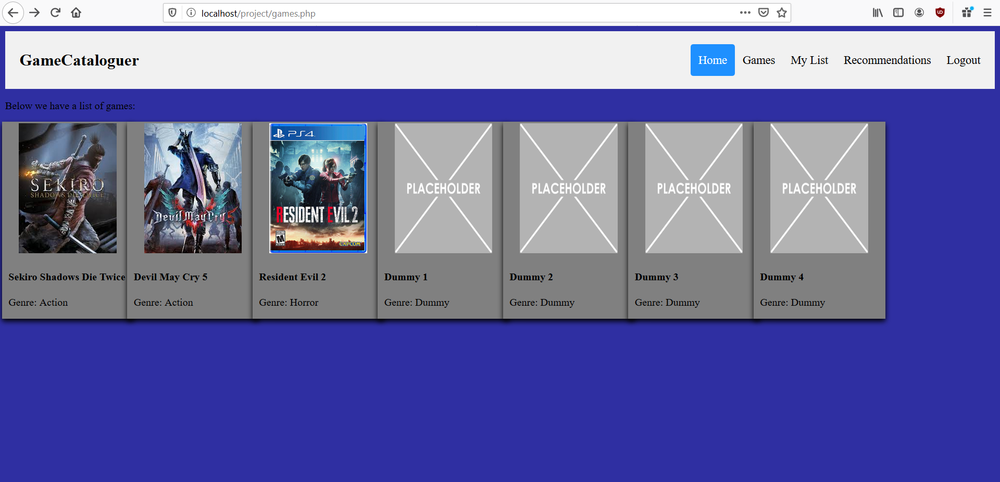
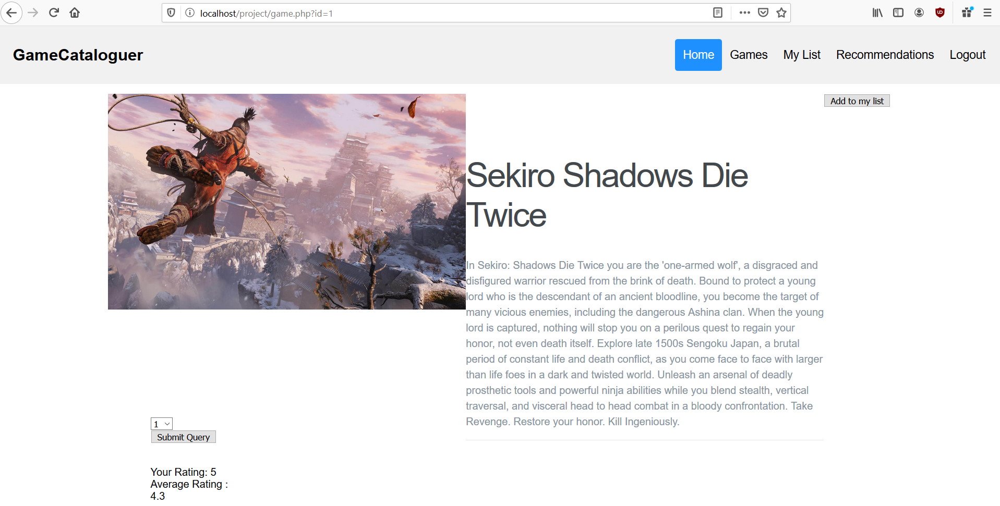
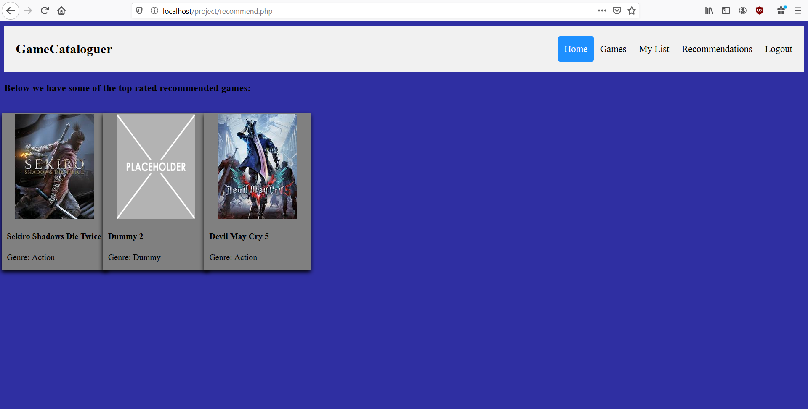

# game-cataloguing-website
A college project in which a game cataloguing website implemented in pure HTML,CSS,JavaScript and PHP where you can keep track of what games you're playing and want to play along with a rating system.
 
The front end is currently extremely barebones and not very good.  
This project used Xampp and phpMyAdmin.  

